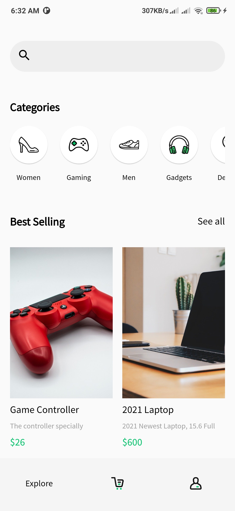
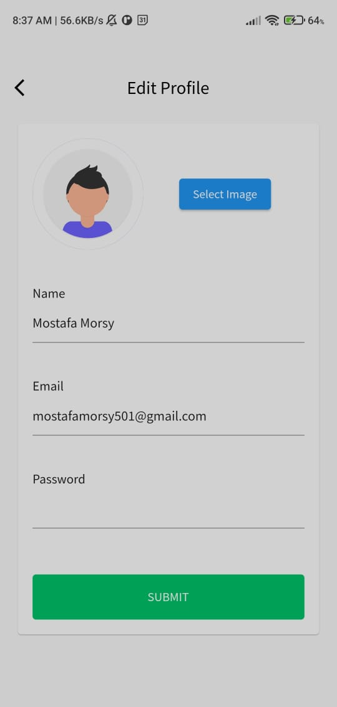

# E-Commerce

## Introduction:

    Let me give you a brief overview of the project, 
    Contain an Auth methode (Login - Signup) in addition to login with (facebook - google) also profile screen to edit the user profile.
    there is anther 2 screen Explore screen to show Best selling from products and categories also search bar,
    and as a second screen is a cart screen to show the totel price also to checkout process and same screen like view deatils of productand more.

## This Project Created use :
        - Sign-In, Sign-Up and LogOut using Email & Password / Google Account / Facebook Account.
        - Categories and Search for Products.
        - Add/Remove Products to/from Cart.
        - Change quantity of products in the cart.
        - Check out your Cart and Make an Order.
        - Edit your account information and upload image at Profile section.
        - Check your recent orders at Order History.
        - Using Responsive UI.
        - Using Firebase & SQLite.
        - Using GetX as state management.

## ScreenShots

